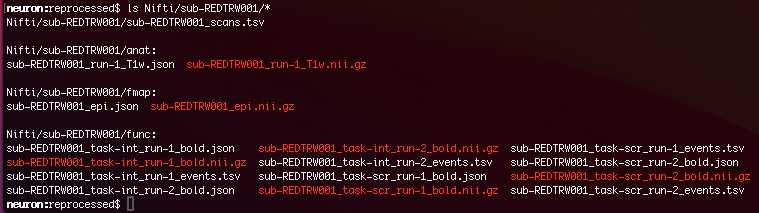

# fMRI Preprocessing at UMD

- [setup.sh](https://github.com/hspopal/tutorials/blob/main/neuroimaging/umd_preprocessing/code/setup.sh)
- [heuristi.py]()
- [preprocessing-bswift.sh]()
- [heudiconv.sh]()
- [fmriprep-bswift2.sh]()
- [data_transfer.sh]()

## Background Information
These series of scripts were written to get a new MRI project started, download data, and preprocessing it using fmriprep. These steps are done on a lab server, such as neuron in the DSCN lab. The fmriprep preprocessing takes place on the BSWIFT2 high performance cluster (HPC). The scripts can be modified for your needs, for different datasets and servers. All of the scripts references in this documentation are available in the `code` directory. These scripts will have to be placed in specific locations for them to work together. All of those details are noted below.

These scripts are meant to make some tedius work in processing your data more streamlined. Users of these scripts should understand most of the underlying code. Users should absolutely have basic knowledge of the command line and langauges such as Bash. Users should be able to easily navigate through directories and remote servers. If you are not comfortable with these skills, see these tutorials and tread carefully. 

### Singularity


## Setup
For a new project, a new project directory will have to be created in BIDS format. For this pipeline, that includes the main project directory. The main project directory referenced here is `/data/neuron/TRW/reprocessed`. This dataset utilizes a previously collected dataset, in which I converted everything to BIDS format and ran fmriprep. Which is why there is a `reprocessed` directory. Subdirectories should also be created for the following:

- `sourcedata`
    - Location for the raw dicom files will be located
- `Nifti`
    - Location for NIFTI files
- `code`
    - Location for scripts and other code
- `derivatives`
    - Location for "derivatives" from this project, such as the preprocessing output and any analyses 

Once these files have been created, place the `preprocessing-bswift2.sh`, `heuristic.py`, and `heudiconv.sh` scripts into the code directory. If you will not being using a HPC (e.g. BSWIFT), then place the `fmriprep-bswift2.sh` script in the code directory as well. **Note:** this documentation assumes that you will be using a HPC for fmriprep preprocessing. If you are not, you will have to change the relevant paths and skip certain steps. 

The `setup.sh` script is meant to help users run the relevant commands for this pipeline. The beginning of the script has users set a quick variable for the project or BIDS directory and create a list of subject IDs that will be used in for loops to complete the pipeline steps. 


## Preprocessing
The main script for this pipeline is the `preprocessing-bswift2.sh` file. Certain variables and paths need to be edited in this file for your specific setup. These can be found between lines 79 and 89. 

### Downloading dicoms
The next step would be to download the dicoms for your participants. For a single participant you can run the code:
```
sh code/preprocessing_TRW-bswift2.sh -s 001 -d
```
This will download the dicoms from subject 001 (with the appropriate prefix you noted in the above script) from the MNC servers and place them in the `sourcedata` directory. The `setup.sh` script has a for loop than can be used to run this for all your participants, utilizing the subject list defined at the beginning of the script.


### Converting dicoms to NIFTIs
We can use the clever heudiconv software to convert our dicoms to NIFTI files in BIDS format. First, ensure that you have singularity installed on your lab server. You should also download a heudiconv singularity, and I recommend you put in a general location that you can use for multiple projects. Heudiconv will be used to automatically convert your scans from the individual dicoms to NIFTI files in the appropriate directories depending on whether the scans are anatomical, field maps, or functional scans. There is also a method to convert diffusion weighted images (DWI). First, we need to tell heudiconv what kinds of files to look for. We will use heudiconv to take a quick peek at the data, before we ask it to convert the dicoms to NIFTIs.

#### Setting up the heuristic.py file
The `setup.sh` script has a singularity command that allows us to peak at the type of data we have:
```
singularity exec \
    --bind /data/neuron/TRW/reprocessed:/base \
    /software/neuron/Containers/heudiconv_latest.sif \
    heudiconv \
    -d /base/sourcedata/RED_TRW_{subject}/*/*/*.dcm \
    -o /base/Nifti \
    -f reproin \
    -s 001 \
    -c none \
    --overwrite 
```
Let's break down this code:

- singularity exec
    - This runs singularity
- bind
    - Singularity needs to be told some paths so that it can do its container thing
    - We give it the path for the overall project or BIDS directory which will be refereced to as "base" within the singularity container, and a path to the heudiconv image (heudiconv_latest.sif)
- d
    - The path for where the dicoms will be located, but starting the path from the "base" (e.g. `/base/sourcedata` since base is defined as `/data/neuron/TRW/reprocessed` and put the raw dicoms for each subject in `/data/neuron/TRW/reprocessed/sourcedata`
    - Use wildcards to find all the dicoms for a particular partcipant's data
- o
    - Output directory for the NIFTIs
- f
    - We input the reproin [software](https://github.com/ReproNim/reproin)
- s
    - Subject ID
- c
    - This is the command we want to do
    - Right now this is none, but later we will rerun this code to actuall convert the dicoms to NIFTIs
- overwrite
    - Overwrites the data if it already exists

Once this command is run, it will create a hidden directory, `.heudiconv/`, in your BIDS directory (e.g. `/data/neuron/TRW/reprocessed/.heudiconv/`). Inside this hidden directory, you will find a subdirectory for 001, and a further subdirectory `info` which contains a `dicominfo.tsv` file. This file contains the sequence information for each scan, such as the sequence name, dimensions, TR and TE information, etc. 
[](docs/dicominfo.png)
We can use this information in the `heuristic.py` file. **Note:** running the above command may also create a `heuristic.py` file. I have found this "newer" version to be confusing. The `heuristic.py` file I have included here is more simple in my opinion. 

Next, while referencing the `dicominfo.tsv` spreadsheet, update the appropriate information in the `heuristic.py` script to create a key for your scans. In the files I have attached, I am noting that the t1_mpr_sag_p2_iso_0.9 MRI sequence name along with its specific dimensions should be converted to a t1w NIFTI file. I also note the specific fMRI sequences and the task names I would like to use (e.g. sequence cmrr_F6_R2.2C_TR1250_V293_int is named func_task_1, which I defined with the prefix task-int). More information on how to setup your heuristic file can be found in this [tutorial]().

Once your `heuristic.py` file is setup, edit the `heudiconv.sh` script to have the appropriate inputs for the singularity command for your dataset. Then, we can run the `-n` flag with our preprocessing script to create NIFTIs.
```
sh code/preprocessing_TRW-bswift2.sh -s 001 -n
```
Once this command is finished, you should see a subdirectory (e.g. `sub-REDTRW001`) in the `Nifti` directory. This is your MRI data in BIDS format for your subject. Inside, you should see NIFTI files for the anatomical, fieldmap, and functional scans. 

If you do not see these files, along with some json files, then check your `heuristic.py` file to make sure your keys and inputs are correct. Most issues in getting your files converted occur because of errors in the `heuristic.py` file. There are also extra files in the `Nifti` directory which are created by heudiconv to match BIDS format, and that you can use in your later processing (e.g. `Nifti/dataset_description.json`)


### Running fmriprep


### Transfer data


